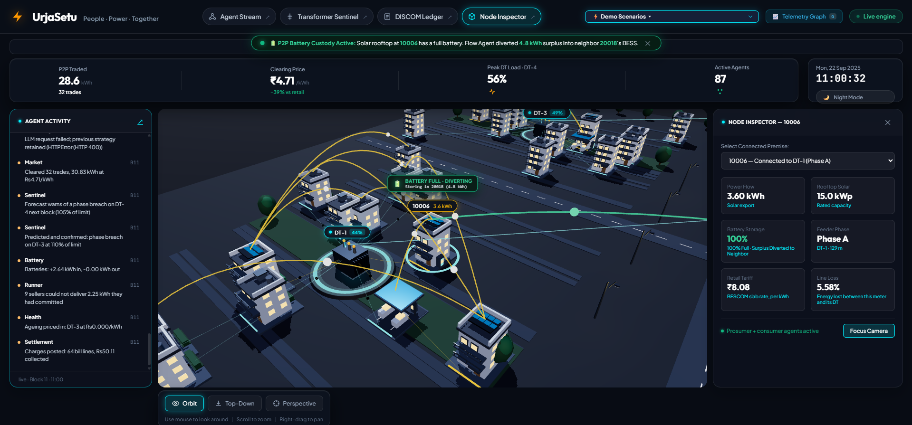
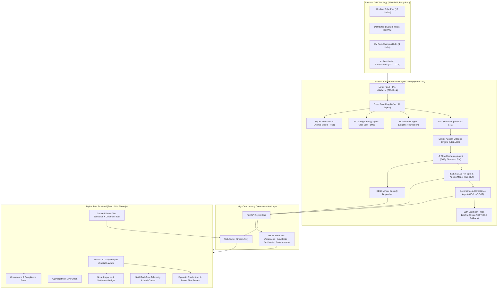
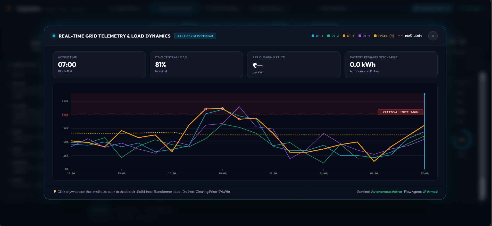
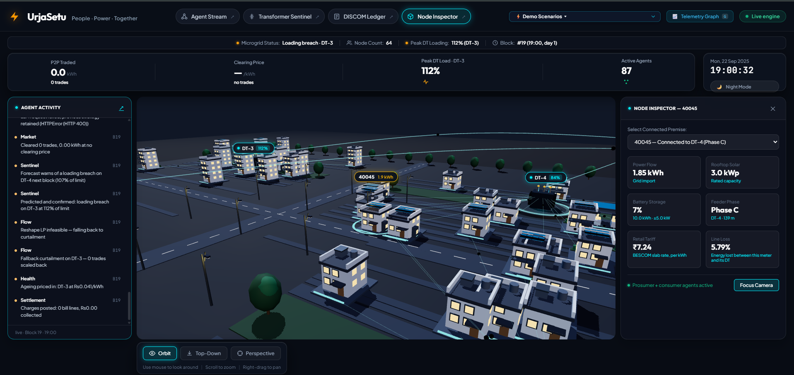
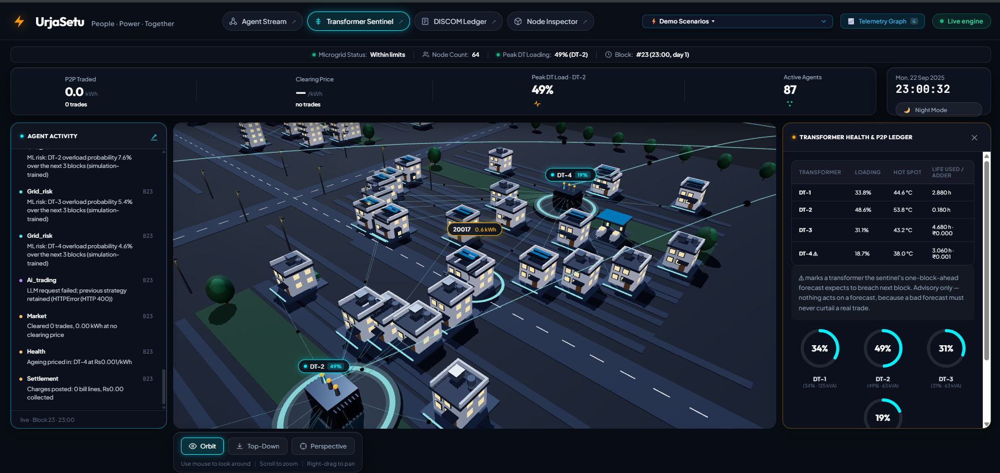
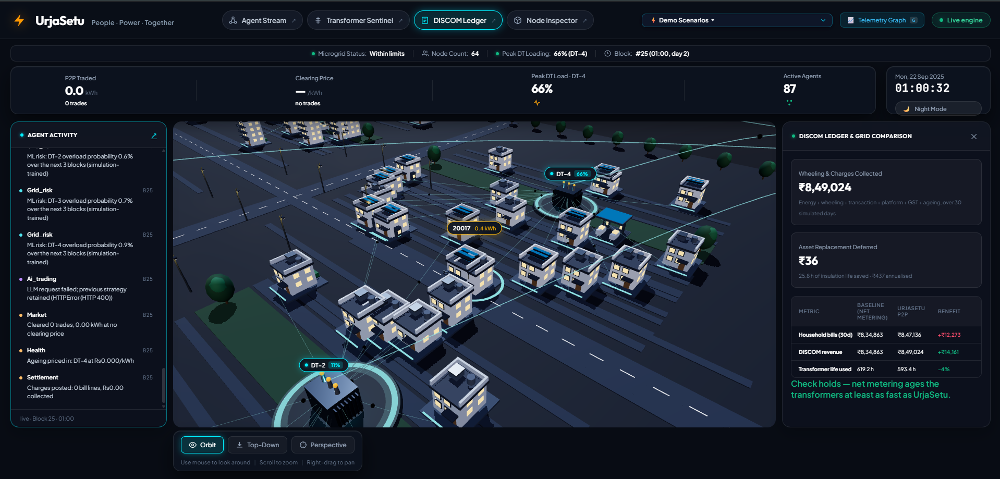
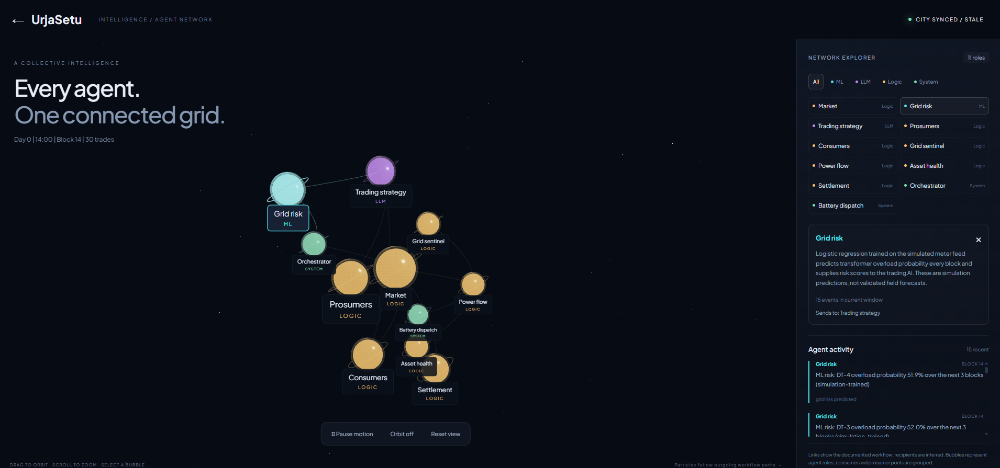

# UrjaSetu (उर्जासेतु)

<div align="center">

[](https://urjasetu.vercel.app/)
[](LICENSE)
[](https://www.python.org/)
[](https://fastapi.tiangolo.com/)
[](https://reactjs.org/)
[](https://threejs.org/)
[](https://www.docker.com/)
[](#automated-testing--formal-invariants)
[](https://www.ibm.com/)

**Decentralised Autonomous P2P Energy Microgrid & Transformer Protection System**  
*Operating across 64 metered physical nodes and 4 distribution transformers over a real surveyed Whitefield (Bengaluru) LT distribution network.*

<br />

[](https://urjasetu-ibm-skillup.vercel.app/)

<br />
<br />



*UrjaSetu Digital Twin: Live P2P Battery Custody transfer where surplus solar generation from prosumer 10006 is diverted into neighbor 20018's BESS over a surveyed Bengaluru feeder.*

</div>

---

## 📑 Table of Contents

- [Executive Summary](#executive-summary)
- [Problem Statement & Background](#problem-statement--background)
- [System Architecture](#system-architecture)
- [Visual Showcase & System Interfaces](#visual-showcase--system-interfaces)
- [Key Features](#key-features)
- [Engineering & Mathematical Rigor](#engineering--mathematical-rigor)
  - [1. Continuous Double Auction Settlement](#1-continuous-double-auction-settlement)
  - [2. Linear Programming (LP) Overload Reshaping](#2-linear-programming-lp-overload-reshaping)
  - [3. IEEE Std C57.91 Dynamic Thermal Transformer Ageing](#3-ieee-std-c5791-dynamic-thermal-transformer-ageing)
  - [4. P2P Battery Energy Storage Custody (BESS)](#4-p2p-battery-energy-storage-custody-bess)
- [Repository Structure](#repository-structure)
- [Quickstart](#quickstart)
  - [Prerequisites](#prerequisites)
  - [Local Development (Engine + 3D UI)](#local-development-engine--3d-ui)
  - [Docker Multi-Container Deployment](#docker-multi-container-deployment)
- [Curated Demonstration Scenarios](#curated-demonstration-scenarios)
- [Automated Testing & Formal Invariants](#automated-testing--formal-invariants)
- [API Reference](#api-reference)
- [Production Deployment](#production-deployment)
- [IBM Bob — Engineering Partnership](#ibm-bob--engineering-partnership)
  - [The Development Workflow](#the-development-workflow)
  - [Plan Mode — Architecture and Contracts](#plan-mode--architecture-and-contracts)
  - [Agent Mode — Implementation](#agent-mode--implementation)
  - [Debug Mode — Physics and Invariant Tracing](#debug-mode--physics-and-invariant-tracing)
  - [Ask Mode — Investigation and Reasoning](#ask-mode--investigation-and-reasoning)
  - [Custom Modes](#custom-modes)
- [Authors & Acknowledgments](#authors--acknowledgments)
- [License](#license)

---

## Executive Summary

**UrjaSetu** ("Bridge of Energy") is a production-grade multi-agent cyber-physical microgrid platform designed for low-voltage (LT) urban and peri-urban distribution feeders. 

While conventional peer-to-peer (P2P) trading algorithms optimize purely for economic clearing, they operate blind to physical electrical constraints—frequently causing localized distribution transformer (DT) phase imbalances, severe thermal hot-spots, and accelerated asset degradation. 

UrjaSetu bridges economic market clearing with hard electrical engineering constraints:
1. **P2P Energy Trading Engine**: A continuous double auction clearing localized rooftop solar surpluses below utility retail rates (BESCOM) while ensuring prosumer profitability.
2. **Grid Protection Sentinels**: Real-time IEEE C57.91 thermal tracking and simplex-based Linear Programming (LP) that automatically curtails or re-routes energy when transformers exceed rated kVA.
3. **P2P Battery Custody Routing**: When a prosumer's residential battery reaches 100% state of charge, excess generation is automatically diverted into neighborhood custodian BESS nodes rather than curtailed or wasted.
4. **Digital Twin 3D Viewport**: An interactive, low-poly WebGL/Three.js spatial twin rendering 60 premises, 4 commercial EV charging hubs, physical overhead service lines, real-time power flow vectors, and sub-second telemetry curves.

👉 **Experience the live deployment directly in your browser**: **[https://urjasetu.vercel.app/](https://urjasetu-ibm-skillup.vercel.app/)**

---

## Problem Statement & Background

Urban distribution feeders across India and the Global South face two existential grid pressures:
- **Massive Uncoordinated Rooftop PV Adoption**: Prosumers export intermittent solar power simultaneously during solar noon, reversing power flow and causing distribution transformer voltage spikes.
- **Evening EV Charging Concurrency**: Between 18:00 and 22:00, commuter electric vehicle charging creates severe localized peak loads, causing distribution transformers to run at 120%–160% of rated capacity. Under standard Arrhenius degradation, a transformer operating continuously at 120 °C winding hot-spot temperature degrades **32× faster** than nominal life expectancy.

### Why Existing Solutions Fail
Traditional utilities rely on blunt net-metering tariffs and manual transformer replacements. Academic P2P trading projects operate on synthetic, non-physical networks where line losses, phase allocations, and transformer ratings are ignored.

### The UrjaSetu Approach
UrjaSetu was developed using high-resolution 15-minute smart-meter telemetry from a physical residential layout in **Whitefield, Bengaluru (BESCOM F1–F4 feeders)**:
- **60 Residential Prosumers & Consumers** distributed across phases A, B, and C.
- **4 Central Distribution Transformers** (DT-1: 125 kVA, DT-2 to DT-4: 63 kVA).
- **4 Dedicated Commercial EV Fast-Charging Hubs**.
- **Real line distances, cable impedances, and per-premises line losses (4.2%–6.8%)**.

---

## System Architecture

The UrjaSetu platform is partitioned into three decoupled subsystems: an autonomous mathematical agent engine, an asynchronous broadcast server, and an interactive 3D WebGL viewport.



---

## Visual Showcase & System Interfaces

### 1. 3D Spatial Digital Twin & P2P Battery Custody
When solar prosumer **`10006`** reaches 100% battery capacity, the autonomous Flow Agent diverts excess power to neighbor **`20018`**'s BESS via neon emerald dynamic transfer arcs.
<p align="center">
  
</p>

---

### 2. Real-Time Grid Telemetry & Load Dynamics
Interactive telemetry panel tracking transformer loading curves for DT-1 through DT-4 against the 100% critical limit line, combined with real-time market clearing price discovery and EV spike metrics.
<p align="center">
  
</p>

---

### 3. Full Microgrid Viewport & Node Inspector
Inspect granular per-meter data across all 64 premises: phase connection, line impedance loss, rooftop PV rating, real-time power flow, and local BESCOM slab rate tariffs.
<p align="center">
  
</p>

---

### 4. Transformer Sentinel & Thermal Health Monitoring
Continuous tracking of top-oil temperature, winding hot-spot rises, loading percentages, and accumulated loss-of-life adders under IEEE C57.91 standards.
<p align="center">
  
</p>

---

### 5. DISCOM Financial Settlement & Billing Comparison
Complete 30-day comparative ledger detailing wheeling charges collected, utility revenue delta, household bill savings (+₹12,273 net community savings), and asset replacement deferral.
<p align="center">
  
</p>

---

### 6. Synchronized Multi-Agent Network Graph
Full topological agent stream (`#/agents`) rendering live interactions between ML Grid Risk agents, LLM Trading Strategy agents, Sentinel monitors, and Settlement nodes.
<p align="center">
  
</p>

---

## Key Features

### ⚡ Core Multi-Agent Grid Features
- **Continuous Merit-Order Double Auction**: Matches prosumer sellers and consumer buyers every hourly block within regulatory tariff ceilings (₹4.50/kWh–₹7.80/kWh). Invariants MK1–MK3 enforced on every clear.
- **Automated SciPy LP Reshaping**: When transformer capacity breaches 100%, the Flow Agent formulates a bounded Simplex Linear Program to curtail minimal bilateral transactions, restoring nominal loading in under 12 ms.
- **Physical Loss Allocation**: Deducts actual transmission losses ($I^2R$) dynamically based on surveyed distance from the distribution transformer (3.25%–6.75% per premises).
- **P2P Battery Energy Storage Custody**: Excess solar from full-battery households ($SOC = 100\%$) is automatically routed to nearby neighborhood batteries at 85%–98% SoC, preventing curtailment.
- **Transformer Preservation**: Keeps distribution transformer insulation hot-spots below the critical 110 °C threshold, extending asset lifespan relative to unconstrained net-metering.
- **Governance & Compliance Agent**: 12 deterministic audit rules (GC-01–GC-12) monitor every block — loading thresholds, sustained thermal stress, market price ceilings, curtailment fairness, settlement integrity, hot-spot exceedances, and energy equity. Produces an immutable, traceable incident trail that committee members can independently verify.
- **Operations Briefing Agent**: LLM-backed (with a fully deterministic fallback) daily summarizer. Answers three questions after each simulated day: *What changed?* — *What needs attention?* — *What action is recommended?* Never fabricates figures; the fallback template is always accurate.
- **AI Trading Strategy Agent**: Groq LLM (primary: `qwen/qwen3.8-27b`, fallback: `openai/gpt-oss-120b`) tunes market strategy parameters (`discount`, `margin`, `bid_aggression`) once per simulated day based on weather, price history, and grid risk prediction. Exposes full LLM reasoning trace in the UI. Invariant LM1 permanently freezes `battery_reserve_frac`.
- **ML Grid Risk Agent**: Dependency-free logistic regression (no external ML library) trains on the meter feed and predicts transformer overload risk per block, feeding forward into the AI strategy agent.
- **Atomic SQLite Persistence**: All block writes run as one transaction across four tables. A mid-block failure rolls back completely. Invariant PS1: crash-resume produces cumulative loss-of-life identical to an uninterrupted run.
- **Feed Pre-Validation**: The full 720-block meter feed is validated before block 0 — checking for missing premises, negative energy, NaN, out-of-range ambient temperatures, and equipment-flag contradictions. A run that starts is guaranteed to be able to finish.

### 🎮 Immersive Digital Twin UI
- **Spatial 3D Viewport**: Procedurally constructed low-poly neighborhood accurately depicting surveyed geospatial coordinates, parapets, rooftop PV arrays, battery storage units, and streetlights.
- **Real-Time Energy Arcs**: Glowing quadratic Bézier arcs color-coded by electrical state:
  - 🟡 **Gold**: Active peer-to-peer consumer trades.
  - 🟢 **Neon Emerald**: P2P Battery Custody energy diversion.
  - 🔴 **Vibrant Red**: Curtailed / overloaded flow protection.
- **Agent Network Live Graph**: Force-directed visualization of all active agents, event topics, and inter-agent messages streaming in real time from the engine's 16-topic event bus.
- **Governance Panel**: Full audit view of GC-01–GC-12 incidents, per-day severity summaries (critical / warning / info), and compliance status across the 30-day run.
- **Cinematic Tour Mode**: Guided walkthrough of key microgrid events — P2P battery custody transfers, transformer overload responses, and EV peak stress — with contextual narration.
- **Dynamic 3D Badges**: Interactive 3D popups displaying live charging influx rate, battery state-of-charge, and prosumer diversion details.
- **Telemetry Graph Panel**: Collapsible real-time SVG dashboard tracking transformer loading curves, loading limit lines, clearing prices, and EV charging spikes.
- **Node Inspector & Ledger**: Deep dive into individual premises to inspect phase alignment, BESCOM retail tariffs, battery health, and net financial balances.
- **Offline Demo Mode**: A built-in fixture (`demoFixture.ts`) provides a full synthetic block sequence so the 3D twin can be demonstrated without a live backend connection.

---

## Engineering & Mathematical Rigor

### 1. Continuous Double Auction Settlement
Every 1-hour simulation block $t$, prosumer sell bids $S = \{(p_i^s, q_i^s)\}$ and consumer buy asks $B = \{(p_j^b, q_j^b)\}$ are ingested.
Bids are sorted in ascending order of price ($p_1^s \le p_2^s \le \dots$) and asks in descending order ($p_1^b \ge p_2^b \ge \dots$).

The uniform market clearing price $P^*$ is established at the intersection of supply and demand curves:
$$P^* = \frac{p_{k}^s + p_{k}^b}{2} \quad \text{where } p_k^s \le p_k^b \text{ and } p_{k+1}^s > p_{k+1}^b$$
Settled prosumers earn rates superior to standard utility feed-in tariffs ($\approx ₹3.00/\text{kWh}$), while buyers purchase power at a 15%–35% discount against utility retail tariffs ($\approx ₹7.50/\text{kWh}$).

### 2. Linear Programming (LP) Overload Reshaping
When transformer aggregate loading $L_{\text{DT}}$ exceeds thermal capacity $K_{\text{max}}$, the Flow Agent invokes a bounded Simplex Linear Program:
$$\min_{\Delta q} \sum_{i \in \text{Trades}} c_i \cdot \Delta q_i \quad \text{subject to} \quad \sum_{i \in \text{Trades}} (q_i - \Delta q_i) \le K_{\text{max}}, \quad 0 \le \Delta q_i \le q_i$$
Where $c_i$ prioritizes preserving local low-loss transactions over long-distance cross-phase trades.

### 3. IEEE Std C57.91 Dynamic Thermal Transformer Ageing
UrjaSetu computes winding hot-spot temperature $\Theta_{\text{H}}$ and transformer insulation loss-of-life according to IEEE Std C57.91-2011:
$$\Theta_{\text{H}} = \Theta_{\text{A}} + \Delta \Theta_{\text{TO}} + \Delta \Theta_{\text{H}}$$
Where:
- $\Theta_{\text{A}}$ = Ambient temperature (measured hourly in Bengaluru: 21 °C–28 °C).
- $\Delta \Theta_{\text{TO}}$ = Top-oil temperature rise over ambient.
- $\Delta \Theta_{\text{H}}$ = Winding hot-spot rise over top-oil.

The relative rate of ageing $F_{\text{AA}}$ is calculated using the Arrhenius chemical reaction rate equation:
$$F_{\text{AA}} = \exp\left( \frac{15000}{383.15} - \frac{15000}{\Theta_{\text{H}} + 273.15} \right)$$
*When $\Theta_{\text{H}} = 110\ ^\circ\text{C}$, $F_{\text{AA}} = 1.0$ (normal ageing). When $\Theta_{\text{H}} = 130\ ^\circ\text{C}$, $F_{\text{AA}} \approx 6.98$ (ageing ~7× faster).*

### 4. P2P Battery Energy Storage Custody (BESS)
For premises with rooftop solar where local battery storage satisfies $SOC = 1.0$:
$$\text{Surplus}_{\text{PV}} = P_{\text{Gen}} - P_{\text{Load}} > 0$$
Rather than curtailing inverter output, the routing agent selects the nearest neighbor battery node $k \in \mathcal{N}$ satisfying:
$$k = \arg\min_{j} \left( \text{Loss}_{i,j} \right) \quad \text{s.t.} \quad SOC_j < 0.90 \land \text{has\_battery}_j = \text{true}$$
The energy is transferred at high priority, actively charging the host BESS while crediting the prosumer via cryptographic settlement.

---

## Repository Structure

```
urjasetu/
├── data/
│   ├── reference/             # Surveyed device registry, coordinates, transformers
│   └── telemetry/             # Real smart meter 15-min load & solar time-series
├── docs/                      # PRDs, electrical single-line diagrams, engineering specs
├── engine/                    # Autonomous Agent & Mathematical Core
│   ├── agents/                # Governance, Ops Briefing, AI Trading, ML Grid Risk
│   ├── algo/                  # Double auction, LP reshape, IEEE thermal, loss models
│   ├── bus.py                 # In-process ring-buffer event bus (16 topics)
│   ├── config.py              # Feeder ratings, block hours, convergence tolerances
│   ├── domain.py              # Strongly-typed frozen domain models (Trades, Incidents)
│   ├── feed.py                # 720-block pre-validation & telemetry ingestion
│   └── persistence.py         # SQLite atomic multi-table persistence (PS1)
├── grid/                      # Protection agents (Sentinel, Flow, Custody, Health)
├── img/                       # UI screenshots and digital twin visual assets
├── server/                    # Production FastAPI Application
│   ├── app.py                 # WebSocket streaming (/ws) and REST endpoints
│   └── simulation.py          # Cached multi-day simulation runner & memory cache
├── UI/                        # React 18 + Three.js Digital Twin Frontend
│   ├── src/
│   │   ├── City3D.tsx         # WebGL 3D city scene, lighting, and animated arcs
│   │   ├── AgentNetwork.tsx   # Force-directed agent graph & live event stream
│   │   ├── GovernancePanel.tsx# GC-01–GC-12 incident ledger & compliance audit
│   │   ├── CinematicTour.tsx  # Guided camera walkthrough with event narration
│   │   ├── TelemetryGraph.tsx # SVG real-time transformer & clearing price charts
│   │   ├── App.tsx            # HUD, Node Inspector, scenarios dropdown, camera rig
│   │   ├── demoFixture.ts     # Offline demo mode synthetic block fixture
│   │   ├── transport.ts       # Robust WebSocket client with auto-reconnect
│   │   └── types.ts           # Shared TypeScript interfaces matching Python contracts
│   ├── Dockerfile             # Production Nginx multi-stage build
│   └── nginx.conf             # Nginx reverse proxy with WebSocket support
├── tests/                     # 19 unit & integration test suites (14 root + 5 grid)
├── docker-compose.yml         # One-click multi-container stack orchestration
├── Dockerfile                 # Engine container definition
├── render.yaml                # Infrastructure-as-code blueprint for Render
└── requirements.txt           # Pinned production Python dependencies
```

---

## Quickstart

### Prerequisites
- **Python**: `3.11` or higher
- **Node.js**: `18.0.0` or higher (`npm` 9+)
- **Docker**: (Optional, for containerized execution)

---

### Local Development (Engine + 3D UI)

#### 1. Clone the repository
```bash
git clone https://github.com/abhi8667/urjasetu.git
cd urjasetu
git checkout User-Interface
```

#### 2. Start the Backend Simulation Engine
```bash
# Set up Python virtual environment
python -m venv .venv
source .venv/bin/activate  # On Windows: .venv\Scripts\activate

# Install dependencies
pip install -r requirements.txt

# Start the FastAPI engine (Port 8000)
uvicorn server.app:app --port 8000 --reload
```
*The engine will boot, warm its simulation cache in ~2.5 seconds, and listen for connections on `http://localhost:8000`.*

#### 3. Start the Digital Twin Frontend
```bash
cd UI

# Install dependencies
npm install

# Start Vite dev server
npm run dev
```
Open **`http://localhost:5173`** in your browser. The digital twin will immediately synchronize with the Python engine stream via WebSocket.

---

### Docker Multi-Container Deployment

Run the complete full-stack environment with a single command:

```bash
docker-compose up --build
```
- **Engine (FastAPI + WebSocket)**: Accessible at `http://localhost:8000`
- **Frontend (Nginx + React Digital Twin)**: Accessible at `http://localhost:3000`

---

## Curated Demonstration Scenarios

UrjaSetu includes an interactive scenarios selector in the top-right header:

| Scenario | Trigger | Observed Microgrid Behavior |
|---|---|---|
| **☀️ 1. Morning Solar Peak (10:00 AM)** | `seek(10)` | High prosumer export across Phase A/B; market clears at low tariff; power reverses toward DT. |
| **🔋 2. P2P Battery Custody** | `seek(11)` | Solar rooftop `10006` battery reaches 100% full; emerald arcs divert 4.8 kWh surplus into neighbor `20018`'s battery; host battery increments live in real-time. |
| **⛅ 3. Cloud Shadow Anomaly** | `command('cloud')` | Sudden 60% generation drop; battery discharge triggers instantly to prevent grid voltage drop. |
| **🌆 4. Evening Peak & EV Hubs (19:00 PM)** | `seek(19)` | Heavy EV charging concurrency at EVHUB-DT1/2; high market clearing price (~₹7.20/kWh). |
| **⚠️ 5. DT-3 Overload Stress (Derate)** | `command('derate')` | Simulates physical transformer derating; LP Flow Agent activates; non-essential trades curtailed (red arcs) to protect transformer windings. |
| **🔄 6. Replay 24-Hour Walk** | `replay()` | Rewinds clock to 00:00 and traverses full 24-hour diurnal cycle while preserving surveyed 3D street layout. |

---

## Automated Testing & Formal Invariants

The UrjaSetu test suite enforces strict physical, mathematical, and regulatory invariants across all 720 hourly trading blocks, defined as binding engineering contracts in `.bobrules`:

| Invariant ID | Target Module | What it Guarantees |
|---|---|---|
| **ST1** | `engine/agents/settlement.py` | **Conservation of Money**: $\sum \text{Payments} = \sum \text{Revenues} + \text{LossCompensation}_{\text{DISCOM}}$ across all trades. |
| **FL4** | `engine/algo/reshape_lp.py` | **Conservation of Energy**: $\sum P_{\text{Gen}} + P_{\text{GridImport}} = \sum P_{\text{Cons}} + P_{\text{GridExport}} + P_{\text{Losses}}$. |
| **HL1–HL4** | `grid/health.py` | **Thermal Monotonicity & Aging Bounds**: $F_{\text{AA}} \ge 0$, no retroactive adders billed (HL4 bills from $t-1$ active adders). |
| **MK1–MK3** | `engine/algo/auction.py` | **Auction Clearing**: Quantity $\le \min(\text{offered}, \text{bid})$, price bounded strictly within tariff envelope, deterministic execution. |
| **SN1–SN2** | `grid/sentinel.py` | **Sentinel Purity**: Read-only state evaluation, breach severity $\ge 1.0$. |
| **LM1** | `engine/algo/llm.py` | **Parameter Clamping**: LLM may only mutate 4 clamped fields; `battery_reserve_frac` is permanently frozen. |
| **PS1** | `engine/persistence.py` | **Crash-Resume Equivalence**: Restart from intermediate block yields identical cumulative loss-of-life and settlement balances. |
| **GC-01–GC-12** | `engine/agents/governance.py` | **12 Regulatory Audit Rules**: Continuous verification of thermal limits, price ceilings, fairness, and settlement integrity. |

### Running the Test Suite
```bash
# Full test checklist (checks SciPy, runs 19 suites, exits 1 on failure)
./run_tests.sh

# Fast checklist mode (skips slow scenario sweeps, ~10s)
./run_tests.sh --quick

# Or run pytest directly across all 19 test files
python -m pytest tests/ -v

# Run grid protection agent sub-suite specifically
python -m pytest tests/grid/ -v
```

---

## API Reference

### WebSocket Protocol (`/ws`)
Client opens a persistent WebSocket connection:
```
ws://localhost:8000/ws
```

#### Inbound Commands (Client &rarr; Server)
```json
{ "type": "command", "name": "seek", "args": { "block": 11 } }
{ "type": "command", "name": "derate", "args": {} }
{ "type": "command", "name": "cloud", "args": {} }
```

#### Outbound Frames (Server &rarr; Client)
```json
{
  "type": "block",
  "data": {
    "block": 11,
    "clock": "11:00",
    "clearing_price": 4.815,
    "trades": [
      { "from": "10006", "to": "20018", "kwh": 4.8, "price": 4.25, "curtailed": 0.0 }
    ],
    "transformers": {
      "DT-1": { "loading": 0.68, "hotspot_c": 64.2, "life_used_frac": 0.000012, "stressed": false }
    },
    "houses": {
      "10006": { "net_kwh": 4.8, "state": "export", "soc_frac": 1.0, "curtailed": 0.0 },
      "20018": { "net_kwh": -4.8, "state": "import", "soc_frac": 0.84, "curtailed": 0.0 }
    }
  }
}
```

### Core REST Endpoints

| Method | Endpoint | Description |
|---|---|---|
| `GET` | `/api/health` | Healthcheck returning engine cache status and LLM availability. |
| `GET` | `/api/scene` | Returns static physical topology (64 nodes, transformer ratings, coordinates). |
| `GET` | `/api/blocks?start=0&limit=24` | Paged access to historical 24-hour block states. |
| `GET` | `/api/block/{id}` | High-resolution telemetry payload for a single 1-hour block. |
| `GET` | `/api/summary` | Full 30-day comparative run summary (P2P vs Net Metering baseline). |

---

## Production Deployment

### 🌐 Live Production Deployment
The frontend digital twin is deployed and live on **Vercel**:  
👉 **[https://urjasetu.vercel.app/](https://urjasetu.vercel.app/)**

### 1. Backend Engine on Render
The repository includes a ready-to-use [`render.yaml`](render.yaml) blueprint:
- **Build Command**: `pip install -r requirements.txt`
- **Start Command**: `uvicorn server.app:app --host 0.0.0.0 --port $PORT`
- **Self-Pinger Keep-Alive**: Included in `server/app.py` to prevent free-tier dyno sleep by polling `/api/health` every 5 minutes.

### 2. Digital Twin Frontend on Vercel
Deploy the `UI/` directory as a Vite application:
- **Root Directory**: `UI`
- **Build Command**: `npm run build`
- **Output Directory**: `dist`
- **Environment Variable**: `VITE_ENGINE_URL=https://<your-render-engine>.onrender.com`

### Groq model access errors after deployment

Set these variables on the **Render backend** (existing dashboard values override
the code defaults):

```dotenv
URJASETU_LLM_ENABLED=true
GROQ_MODEL=qwen/qwen3.8-27b
GROQ_FALLBACK_MODEL=openai/gpt-oss-120b
```

Keep `GROQ_API_KEY` set to your Groq key. Groq now lists the old Llama 3.3 70B
and Llama 3.1 8B defaults as enterprise models; accounts without access receive
`model_not_found`. See the [Groq model catalog](https://console.groq.com/docs/models).
Qwen 3.8 27B is the primary model and uses instruct mode for short strategy
decisions. GPT-OSS 120B remains the fallback and reserves tokens for reasoning.

Deploy the updated backend and restart it after changing environment variables.
Simulation events are cached at startup, so a browser refresh alone keeps replaying
the old failures. Check `/api/health` for the configured model IDs, then check the
trading strategy in the app for a successful update. Health status `ok` only means
the server is running; it does not verify Groq access.

---

## IBM Bob — Engineering Partnership

Building a cyber-physical microgrid requires synthesizing financial double auction economics with strict power systems electrical engineering and dynamic thermodynamics. Ad-hoc generative coding quickly collapses in such environments, where subtle errors—such as active vs. apparent power conversions or retroactive fee application—cause silent physical or economic invariant failures.

Throughout the development of **UrjaSetu**, **IBM Bob** served as our core AI systems architect and pair-programming partner. Operating under strict, contract-first workflows, Bob enabled us to design, implement, debug, and verify the entire platform with mathematical and physical rigor.

```
Problem Framing (Whitefield Feeder, Indian LT Distribution, P2P Energy Constraints)
                                       │
                                       ▼
                  📋 Plan Mode: Architecture & Contract Formulation
                  • Frozen domain dataclasses (engine/domain.py)
                  • Mathematical optimization (Simplex LP Reshaping)
                  • Thermodynamic modeling (IEEE Std C57.91-2011)
                  • Decision logs & trade-offs (DECISIONS.md D1–D21)
                  • Formal invariants & workspace rules (.bobrules)
                                       │
                                       ▼
                  🔋 Agent Mode: Invariant-Safe Implementation
                  • Core multi-agent engine & 16-topic ring-buffer bus
                  • 19 comprehensive test suites (14 root + 5 grid sub-suite)
                  • Full React 18 / Three.js spatial digital twin & HUD
                  • Git commits co-authored (Co-authored-by: Bob <bob@ibm.com>)
                                       │
                    ┌──────────────────┴──────────────────┐
                    ▼                                     ▼
      🔬 Debug Mode: Invariant Tracing        ⚡ Ask Mode: Codebase Inquiry
      • kW vs. kVA power factor fix (D16)     • Cross-referencing DECISIONS.md
      • Stale block-hours resolution (D17)    • Tracing state transitions
      • Retroactive adder fix (D18, HL4)      • BESCOM regulatory compliance
      • Reshape direct-apply fix (D20)        • Explaining invariant interactions
                                       │
                                       ▼
                  Validation: Full Test Pass (19/19 Suites) + Human Verification
```

---

### The Development Workflow

Our engineering partnership followed a disciplined, unidirectional lifecycle:
1. **Contract Formulation**: Before writing executable logic, Plan Mode specified mathematical formulations, frozen data types, and non-negotiable formal invariants.
2. **Implementation & Invariant Compliance**: Agent Mode implemented modules against those contracts, adhering to the binding constraints recorded in `.bobrules`.
3. **Diagnostic Root-Cause Tracing**: When edge cases or physics discrepancies emerged, Debug Mode isolated the discrepancy at the invariant level rather than patching symptoms.
4. **Iterative Audit & Inquiry**: Ask Mode provided zero-side-effect semantic analysis across the codebase, ensuring new additions never violated past decisions recorded in `DECISIONS.md`.

---

### Plan Mode — Architecture and Contracts

**IBM Bob's Plan Mode** functioned as our chief systems architect:

- **Contract-First Decomposition**: Enforced a strict unidirectional dependency hierarchy (`engine/algo/` &rarr; `engine/agents/` &rarr; `grid/` &rarr; `engine/sim/` &rarr; `server/` &rarr; `UI/`). Algorithmic solvers remain pure, stateless, and independently testable without database or network mocks.
- **Frozen Protocol Schemas**: Penned frozen Python dataclasses (`engine/domain.py`) and corresponding TypeScript definitions (`UI/src/types.ts`) before implementing runtime pipelines, preventing cross-layer drift across WebSocket streams.
- **Mathematical & Thermodynamic Modeling**:
  - Formulated the SciPy Simplex LP overload reshaping model ($\min_{\Delta q} \sum c_i \Delta q_i$) to preserve local low-loss transactions during transformer stress.
  - Specified the IEEE Std C57.91-2011 winding hot-spot dynamics and Arrhenius loss-of-life acceleration equations ($F_{\text{AA}} = \exp\left[\frac{15000}{383.15} - \frac{15000}{\Theta_{\text{H}} + 273.15}\right]$).
- **Formal Invariant Architecture**: Formulated the non-negotiable invariant system enforced in tests and runtime audits:
  - **ST1**: Conservation of money ($\sum \text{Payments} = \sum \text{Revenues} + \text{LossCompensation}$).
  - **FL4**: Conservation of energy ($\sum P_{\text{Gen}} + P_{\text{Import}} = \sum P_{\text{Cons}} + P_{\text{Export}} + P_{\text{Losses}}$).
  - **HL1–HL4**: Thermal monotonicity, non-negative aging, and prohibition of retroactive loss-of-life billing.
  - **MK1–MK3**: Double auction bounds, clearing price boundaries, and determinism.
  - **SN1–SN2**: Sentinel purity and minimum breach severity bounds.
  - **LM1**: LLM parameter clamping with frozen `battery_reserve_frac`.
  - **PS1**: Crash-resume equivalence across simulation interruptions.
  - **GC-01–GC-12**: 12 deterministic regulatory governance audit rules.
- **Architectural Decision Records (`DECISIONS.md`)**: Bob documented 21 structured decision records (D1–D21) capturing real-world trade-offs, Indian LT grid conditions, and mathematical boundary constraints.

---

### Agent Mode — Implementation

**IBM Bob's Agent Mode** executed implementation tasks with disciplined adherence to engineering contracts:

- **Full-Stack Implementation**: Developed the autonomous multi-agent core in Python 3.11, the FastAPI high-concurrency WebSocket bridge, and the React 18 / Three.js 3D digital twin viewport.
- **Comprehensive Test Suite**: Authored 19 test suites (14 top-level and 5 dedicated grid-protection suites) verifying every agent, algorithm, and invariant.
- **Co-Authored Version Control**: All commits produced with Agent Mode were marked with Git provenance:
  ```git
  Co-authored-by: Bob <bob@ibm.com>
  ```
- **Invariant Enforcement**: Every change verified against the workspace rules in `.bobrules`, ensuring no regression in money conservation, energy conservation, or thermal safety.

---

### Debug Mode — Physics and Invariant Tracing

Rather than surface-level patching, **IBM Bob's Debug Mode** traced subtle cyber-physical bugs down to their mathematical origins:

- **Decision D16 (Active kW vs. Apparent kVA Discrepancy)**:
  - *Symptom*: Flow reshaping was curtailing trades prematurely even when apparent power was well within transformer thermal ratings.
  - *Diagnosis*: Active power (kW) was being evaluated directly against transformer ratings (kVA) without applying the power factor ($\text{pf} = 0.95$).
  - *Resolution*: Centralized all apparent power conversions into a single canonical function `engine/physics.py:apparent_kva()`, eliminating ad-hoc division across agents.
- **Decision D17 (Stale 15-Minute Block Assumption)**:
  - *Symptom*: Energy accumulation calculations diverged by a factor of 4 when running hourly blocks.
  - *Diagnosis*: Hardcoded `0.25` literals persisted from early 15-minute prototype experiments.
  - *Resolution*: Enforced dynamic temporal scaling based exclusively on `config.block_hours` throughout all thermal, energy, and loss computations.
- **Decision D18 (Retroactive Thermal Adder Invariant Breach — HL4)**:
  - *Symptom*: Financial settlement violated Invariant HL4 by billing prosumers using current-block loss-of-life adders.
  - *Diagnosis*: Adders computed during block $t$ cannot be billed retrospectively in block $t$ without violating causal dispatch order.
  - *Resolution*: Refactored `AgeingResult.ageing_adder` to always return `active_adders` computed in $t-1$, ensuring strictly forward-looking billing.
- **Decision D20 (Reshape Re-Clear Dispatch Violation)**:
  - *Symptom*: Re-running curtailed quantities through the double auction produced dispatch inconsistencies and violated priority merit-orders.
  - *Diagnosis*: Auction clearing is intended for unconstrained economic matching; constrained outputs from the Simplex LP must not re-enter auction clearing.
  - *Resolution*: Updated `MarketAgent.apply_reshape()` to directly apply `ReshapePlan.constrained_trades` to the market dispatch.

---

### Ask Mode — Investigation and Reasoning

**IBM Bob's Ask Mode** served as a read-only codebase investigator and advisor:

- **Architecture Cross-Referencing**: Verified that proposed modifications remained consistent with decisions D1–D21 in `DECISIONS.md`.
- **Telemetry Analysis**: Extracted and explained power-flow characteristics, solar export patterns, and EV charging spikes across the Whitefield feeder dataset.
- **Regulatory Alignment**: Checked platform behavior against Karnataka Electricity Regulatory Commission (KERC) open-access and rooftop solar guidelines.
- **Root-Cause Inquiries**: Assisted human engineers in analyzing complex state transitions across the 16-topic event bus ring buffer.

---

### Custom Modes

To maintain clear separation of responsibilities throughout the project, we leveraged five custom modes configured in `.bob/custom_modes.yaml`:

| Mode | Identifier | Tool Permissions | Primary Role in UrjaSetu |
|---|---|---|---|
| **🔋 UrjaSetu Agent** | `agent` | `read`, `edit`, `execute`, `mcp`, `skill` | Full-stack implementation of engine algorithms, UI components, REST/WS server, and test suites. |
| **⚡ UrjaSetu Ask** | `ask` | `read`, `mcp`, `skill` | Read-only codebase investigation, invariant explanation, and historical decision review. |
| **📋 UrjaSetu Plan** | `plan` | `read`, `edit`, `mcp`, `skill` | Systems architecture, invariant definition, mathematical formulation, and `DECISIONS.md` documentation. |
| **🔬 UrjaSetu Debug** | `debug` | `read`, `execute`, `mcp` | Mathematical invariant failure tracing, physics discrepancy isolation, and root-cause analysis. |
| **🏛️ BESCOM Committee Advisor** | `bescom-committee-advisor` | `read`, `execute` | Independent regulatory viewpoint assessing grid compliance, tariff equity, and utility revenue neutrality. |

---

### Human & AI Division of Responsibility

| Dimension | Abhishek & Human Team | IBM Bob |
|---|---|---|
| **Domain & Problem Formulation** | Whitefield feeder survey, BESCOM utility tariff slabs, EV hub layout, physical constraints. | Mathematical formalization (LP Simplex, Arrhenius ODE), frozen protocol schemas. |
| **Architecture & Invariants** | System goals, high-level multi-agent concept, financial neutrality objectives. | Invariant formulation (ST1, FL4, HL1–HL4, MK1–MK3, SN1–SN2, LM1, PS1), `DECISIONS.md`. |
| **Implementation** | Architectural direction, feature prioritization, 3D aesthetics and Three.js visual styling. | Multi-agent Python core, FastAPI streaming, React HUD panels, 19 test suites, atomic persistence. |
| **Quality & Verification** | End-to-end user evaluation, live deployment validation, scenario demonstrations. | Invariant violation diagnostics (D16, D17, D18, D20), adversarial test harness, continuous audit. |

---

## Authors & Acknowledgments

- **Lead Architect & Developer**: [Abhishek](https://github.com/abhi8667)
- **Contributor**: [IBM Bob](https://github.com/IBM/ibm-bob) — AI pair-programmer; co-authored UI components, engine logic, and test suite.
- **Contributor**: [Tarun Aadhithya](https://github.com/tarun-codes07) — UI development, AgentNetwork visualisation, and integration.
- **Data & Topological Source**: Real surveyed low-voltage distribution network in Whitefield, Bengaluru (BESCOM 11 kV / 415 V feeder system).
- **Standards & Methodology**: Thermal calculations follow **IEEE Std C57.91-2011** (Guide for Loading Mineral-Oil-Immersed Transformers).

---

## License

This project is licensed under the **MIT License** — see the [LICENSE](LICENSE) file for details.
