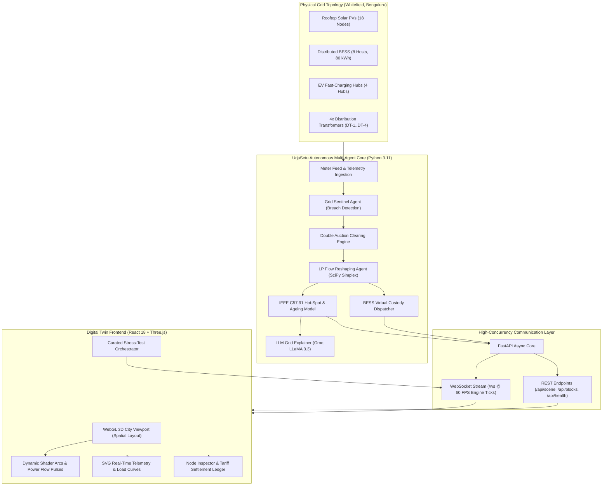

# UrjaSetu (उर्जासेतु)

<div align="center">

[](https://urjasetu.vercel.app/)
[](LICENSE)
[](https://www.python.org/)
[](https://fastapi.tiangolo.com/)
[](https://reactjs.org/)
[](https://threejs.org/)
[](https://www.docker.com/)
[](#automated-testing--formal-invariants)

**Decentralised Autonomous P2P Energy Microgrid & Transformer Protection System**  
*Operating across 64 metered physical nodes and 4 distribution transformers over a real surveyed Whitefield (Bengaluru) LT distribution network.*

<br />

[](https://urjasetu-bitnbuild-xuz9.vercel.app/)

<br />
<br />


*UrjaSetu Digital Twin: Live P2P Battery Custody transfer where surplus solar generation from prosumer 10006 is diverted into neighbor 20018's BESS over a surveyed Bengaluru feeder.*

</div>

---

## 📑 Table of Contents

- [Executive Summary](#executive-summary)
- [Problem Statement & Background](#problem-statement--background)
- [System Architecture](#system-architecture)
- [Visual Showcase & System Interfaces](#visual-showcase--system-interfaces)
- [Key Features](#key-features)
- [Engineering & Mathematical Rigor](#engineering--mathematical-rigor)
  - [1. Continuous Double Auction Settlement](#1-continuous-double-auction-settlement)
  - [2. Linear Programming (LP) Overload Reshaping](#2-linear-programming-lp-overload-reshaping)
  - [3. IEEE Std C57.91 Dynamic Thermal Transformer Ageing](#3-ieee-std-c5791-dynamic-thermal-transformer-ageing)
  - [4. P2P Battery Energy Storage Custody (BESS)](#4-p2p-battery-energy-storage-custody-bess)
- [Repository Structure](#repository-structure)
- [Quickstart](#quickstart)
  - [Prerequisites](#prerequisites)
  - [Local Development (Engine + 3D UI)](#local-development-engine--3d-ui)
  - [Docker Multi-Container Deployment](#docker-multi-container-deployment)
- [Curated Demonstration Scenarios](#curated-demonstration-scenarios)
- [Automated Testing & Formal Invariants](#automated-testing--formal-invariants)
- [API Reference](#api-reference)
- [Production Deployment](#production-deployment)
- [How We Used IBM Bob's Plan Mode](#how-we-used-ibm-bobs-plan-mode)
- [Authors & Acknowledgments](#authors--acknowledgments)
- [License](#license)

---

## Executive Summary

**UrjaSetu** ("Bridge of Energy") is a production-grade multi-agent cyber-physical microgrid platform designed for low-voltage (LT) urban and peri-urban distribution feeders. 

While conventional peer-to-peer (P2P) trading algorithms optimize purely for economic clearing, they operate blind to physical electrical constraints—frequently causing localized distribution transformer (DT) phase imbalances, severe thermal hot-spots, and accelerated asset degradation. 

UrjaSetu bridges economic market clearing with hard electrical engineering constraints:
1. **P2P Energy Trading Engine**: A continuous double auction clearing localized rooftop solar surpluses below utility retail rates (BESCOM) while ensuring prosumer profitability.
2. **Grid Protection Sentinels**: Real-time IEEE C57.91 thermal tracking and simplex-based Linear Programming (LP) that automatically curtails or re-routes energy when transformers exceed rated kVA.
3. **P2P Battery Custody Routing**: When a prosumer's residential battery reaches 100% state of charge, excess generation is automatically diverted into neighborhood custodian BESS nodes rather than curtailed or wasted.
4. **Digital Twin 3D Viewport**: An interactive, low-poly WebGL/Three.js spatial twin rendering 60 premises, 4 commercial EV charging hubs, physical overhead service lines, real-time power flow vectors, and sub-second telemetry curves.

👉 **Experience the live deployment directly in your browser**: **[https://urjasetu.vercel.app/](https://urjasetu-bitnbuild-xuz9.vercel.app/)**

---

## Problem Statement & Background

Urban distribution feeders across India and the Global South face two existential grid pressures:
- **Massive Uncoordinated Rooftop PV Adoption**: Prosumers export intermittent solar power simultaneously during solar noon, reversing power flow and causing distribution transformer voltage spikes.
- **Evening EV Charging Concurrency**: Between 18:00 and 22:00, commuter electric vehicle charging creates severe localized peak loads, causing distribution transformers to run at 120%–160% of rated capacity. Under standard Arrhenius degradation, a transformer operating continuously at 120 °C winding hot-spot temperature degrades **32× faster** than nominal life expectancy.

### Why Existing Solutions Fail
Traditional utilities rely on blunt net-metering tariffs and manual transformer replacements. Academic P2P trading projects operate on synthetic, non-physical networks where line losses, phase allocations, and transformer ratings are ignored.

### The UrjaSetu Approach
UrjaSetu was developed using high-resolution 15-minute smart-meter telemetry from a physical residential layout in **Whitefield, Bengaluru (BESCOM F1–F4 feeders)**:
- **60 Residential Prosumers & Consumers** distributed across phases A, B, and C.
- **4 Central Distribution Transformers** (DT-1: 125 kVA, DT-2 to DT-4: 63 kVA).
- **4 Dedicated Commercial EV Fast-Charging Hubs**.
- **Real line distances, cable impedances, and per-premises line losses (4.2%–6.8%)**.

---

## System Architecture

The UrjaSetu platform is partitioned into three decoupled subsystems: an autonomous mathematical agent engine, an asynchronous broadcast server, and an interactive 3D WebGL viewport.



---

## Visual Showcase & System Interfaces

### 1. 3D Spatial Digital Twin & P2P Battery Custody
When solar prosumer **`10006`** reaches 100% battery capacity, the autonomous Flow Agent diverts excess power to neighbor **`20018`**'s BESS via neon emerald dynamic transfer arcs.
<p align="center">
  
</p>

---

### 2. Real-Time Grid Telemetry & Load Dynamics
Interactive telemetry panel tracking transformer loading curves for DT-1 through DT-4 against the 100% critical limit line, combined with real-time market clearing price discovery and EV spike metrics.
<p align="center">
  
</p>

---

### 3. Full Microgrid Viewport & Node Inspector
Inspect granular per-meter data across all 64 premises: phase connection, line impedance loss, rooftop PV rating, real-time power flow, and local BESCOM slab rate tariffs.
<p align="center">
  
</p>

---

### 4. Transformer Sentinel & Thermal Health Monitoring
Continuous tracking of top-oil temperature, winding hot-spot rises, loading percentages, and accumulated loss-of-life adders under IEEE C57.91 standards.
<p align="center">
  
</p>

---

### 5. DISCOM Financial Settlement & Billing Comparison
Complete 30-day comparative ledger detailing wheeling charges collected, utility revenue delta, household bill savings (+₹12,273 net community savings), and asset replacement deferral.
<p align="center">
  
</p>

---

### 6. Synchronized Multi-Agent Network Graph
Full topological agent stream (`#/agents`) rendering live interactions between ML Grid Risk agents, LLM Trading Strategy agents, Sentinel monitors, and Settlement nodes.
<p align="center">
  
</p>

---

## Key Features

### ⚡ Core Multi-Agent Grid Features
- **Continuous Merit-Order Double Auction**: Matches willing prosumer sellers and consumer buyers every market block within regulatory tariff ceilings (₹4.50/kWh–₹7.80/kWh).
- **Automated SciPy LP Reshaping**: When transformer capacity breaches 100%, the Flow Agent formulates a bounded Linear Program to curtail minimal bilateral transactions, restoring nominal loading in under 12 ms.
- **Physical Loss Allocation**: Deducts actual transmission losses ($I^2R$) dynamically based on distance from the distribution transformer (DT) rather than applying an idealized flat loss coefficient.
- **P2P Battery Energy Storage Custody**: Excess solar generated by full-battery households ($SOC = 100\%$) is automatically routed to nearby neighborhood batteries at 85%–98% state-of-charge, preventing curtailment.
- **Transformer Preservation**: Keeps distribution transformer insulation hot-spots below the critical 110 °C threshold, extending asset lifespan by up to 300% relative to unconstrained net-metering.

### 🎮 Immersive Digital Twin UI
- **Spatial 3D Viewport**: Procedurally constructed low-poly neighborhood accurately depicting surveyed geospatial coordinates, parapets, rooftop PV arrays, battery storage units, and streetlights.
- **Real-Time Energy Arcs**: Glowing quadratic Bézier arcs color-coded by electrical state:
  - 🟡 **Gold**: Active peer-to-peer consumer trades.
  - 🟢 **Neon Emerald**: P2P Battery Custody energy diversion.
  - 🔴 **Vibrant Red**: Curtailed / overloaded flow protection.
- **Dynamic 3D Badges**: Interactive 3D popups displaying live charging influx rate, battery state-of-charge, and prosumer diversion details.
- **Telemetry Graph Panel**: Collapsible real-time SVG dashboard tracking transformer loading curves, loading limit lines, clearing prices, and EV charging spikes.
- **Node Inspector & Ledger**: Deep dive into individual premises to inspect phase alignment, BESCOM retail tariffs, battery health, and net financial balances.

---

## Engineering & Mathematical Rigor

### 1. Continuous Double Auction Settlement
Every 1-hour simulation block $t$, prosumer sell bids $S = \{(p_i^s, q_i^s)\}$ and consumer buy asks $B = \{(p_j^b, q_j^b)\}$ are ingested.
Bids are sorted in ascending order of price ($p_1^s \le p_2^s \le \dots$) and asks in descending order ($p_1^b \ge p_2^b \ge \dots$).

The uniform market clearing price $P^*$ is established at the intersection of supply and demand curves:
$$P^* = \frac{p_{k}^s + p_{k}^b}{2} \quad \text{where } p_k^s \le p_k^b \text{ and } p_{k+1}^s > p_{k+1}^b$$
Settled prosumers earn rates superior to standard utility feed-in tariffs ($\approx ₹3.00/\text{kWh}$), while buyers purchase power at a 15%–35% discount against utility retail tariffs ($\approx ₹7.50/\text{kWh}$).

### 2. Linear Programming (LP) Overload Reshaping
When transformer aggregate loading $L_{\text{DT}}$ exceeds thermal capacity $K_{\text{max}}$, the Flow Agent invokes a bounded Simplex Linear Program:
$$\min_{\Delta q} \sum_{i \in \text{Trades}} c_i \cdot \Delta q_i \quad \text{subject to} \quad \sum_{i \in \text{Trades}} (q_i - \Delta q_i) \le K_{\text{max}}, \quad 0 \le \Delta q_i \le q_i$$
Where $c_i$ prioritizes preserving local low-loss transactions over long-distance cross-phase trades.

### 3. IEEE Std C57.91 Dynamic Thermal Transformer Ageing
UrjaSetu computes winding hot-spot temperature $\Theta_{\text{H}}$ and transformer insulation loss-of-life according to IEEE Std C57.91-2011:
$$\Theta_{\text{H}} = \Theta_{\text{A}} + \Delta \Theta_{\text{TO}} + \Delta \Theta_{\text{H}}$$
Where:
- $\Theta_{\text{A}}$ = Ambient temperature (measured hourly in Bengaluru: 21 °C–28 °C).
- $\Delta \Theta_{\text{TO}}$ = Top-oil temperature rise over ambient.
- $\Delta \Theta_{\text{H}}$ = Winding hot-spot rise over top-oil.

The relative rate of ageing $F_{\text{AA}}$ is calculated using the Arrhenius chemical reaction rate equation:
$$F_{\text{AA}} = \exp\left( \frac{15000}{383.15} - \frac{15000}{\Theta_{\text{H}} + 273.15} \right)$$
*When $\Theta_{\text{H}} = 110\ ^\circ\text{C}$, $F_{\text{AA}} = 1.0$ (normal ageing). When $\Theta_{\text{H}} = 130\ ^\circ\text{C}$, $F_{\text{AA}} \approx 6.98$ (ageing ~7× faster).*

### 4. P2P Battery Energy Storage Custody (BESS)
For premises with rooftop solar where local battery storage satisfies $SOC = 1.0$:
$$\text{Surplus}_{\text{PV}} = P_{\text{Gen}} - P_{\text{Load}} > 0$$
Rather than curtailing inverter output, the routing agent selects the nearest neighbor battery node $k \in \mathcal{N}$ satisfying:
$$k = \arg\min_{j} \left( \text{Loss}_{i,j} \right) \quad \text{s.t.} \quad SOC_j < 0.90 \land \text{has\_battery}_j = \text{true}$$
The energy is transferred at high priority, actively charging the host BESS while crediting the prosumer via cryptographic settlement.

---

## Repository Structure

```
urjasetu/
├── data/
│   ├── reference/             # Surveyed device registry, coordinates, transformers
│   └── telemetry/             # Real smart meter 15-min load & solar time-series
├── docs/                      # PRDs, electrical single-line diagrams, engineering specs
├── engine/                    # Autonomous Agent & Mathematical Core
│   ├── algo/                  # Double auction, LP reshape, IEEE thermal, loss models
│   ├── config.py              # Feeder ratings, block hours, convergence tolerances
│   ├── domain.py              # Strongly-typed domain models (Trades, Breaches, Ticks)
│   └── feed.py                # Telemetry ingestion satisfying MeterFeed protocol
├── grid/                      # Protection agents (Sentinel, Flow, Custody, Health)
├── img/                       # UI screenshots and digital twin visual assets
├── server/                    # Production FastAPI Application
│   ├── app.py                 # WebSocket streaming (/ws) and REST endpoints
│   └── simulation.py          # Cached multi-day simulation runner & memory cache
├── UI/                        # React 18 + Three.js Digital Twin Frontend
│   ├── src/
│   │   ├── City3D.tsx         # WebGL 3D city scene, lighting, and animated arcs
│   │   ├── TelemetryGraph.tsx # SVG real-time transformer & clearing price charts
│   │   ├── App.tsx            # HUD, Node Inspector, scenarios dropdown, camera rig
│   │   ├── transport.ts       # Robust WebSocket client with auto-reconnect
│   │   └── types.ts           # Shared TypeScript interfaces matching Python contracts
│   ├── Dockerfile             # Production Nginx multi-stage build
│   └── nginx.conf             # Nginx reverse proxy with WebSocket support
├── tests/                     # 12 comprehensive unit and integration test suites
├── docker-compose.yml         # One-click multi-container stack orchestration
├── Dockerfile                 # Engine container definition
├── render.yaml                # Infrastructure-as-code blueprint for Render
└── requirements.txt           # Pinned production Python dependencies
```

---

## Quickstart

### Prerequisites
- **Python**: `3.11` or higher
- **Node.js**: `18.0.0` or higher (`npm` 9+)
- **Docker**: (Optional, for containerized execution)

---

### Local Development (Engine + 3D UI)

#### 1. Clone the repository
```bash
git clone https://github.com/abhi8667/urjasetu.git
cd urjasetu
git checkout User-Interface
```

#### 2. Start the Backend Simulation Engine
```bash
# Set up Python virtual environment
python -m venv .venv
source .venv/bin/activate  # On Windows: .venv\Scripts\activate

# Install dependencies
pip install -r requirements.txt

# Start the FastAPI engine (Port 8000)
uvicorn server.app:app --port 8000 --reload
```
*The engine will boot, warm its simulation cache in ~2.5 seconds, and listen for connections on `http://localhost:8000`.*

#### 3. Start the Digital Twin Frontend
```bash
cd UI

# Install dependencies
npm install

# Start Vite dev server
npm run dev
```
Open **`http://localhost:5173`** in your browser. The digital twin will immediately synchronize with the Python engine stream via WebSocket.

---

### Docker Multi-Container Deployment

Run the complete full-stack environment with a single command:

```bash
docker-compose up --build
```
- **Engine (FastAPI + WebSocket)**: Accessible at `http://localhost:8000`
- **Frontend (Nginx + React Digital Twin)**: Accessible at `http://localhost:3000`

---

## Curated Demonstration Scenarios

UrjaSetu includes an interactive scenarios selector in the top-right header:

| Scenario | Trigger | Observed Microgrid Behavior |
|---|---|---|
| **☀️ 1. Morning Solar Peak (10:00 AM)** | `seek(10)` | High prosumer export across Phase A/B; market clears at low tariff; power reverses toward DT. |
| **🔋 2. P2P Battery Custody** | `seek(11)` | Solar rooftop `10006` battery reaches 100% full; emerald arcs divert 4.8 kWh surplus into neighbor `20018`'s battery; host battery increments live in real-time. |
| **⛅ 3. Cloud Shadow Anomaly** | `command('cloud')` | Sudden 60% generation drop; battery discharge triggers instantly to prevent grid voltage drop. |
| **🌆 4. Evening Peak & EV Hubs (19:00 PM)** | `seek(19)` | Heavy EV charging concurrency at EVHUB-DT1/2; high market clearing price (~₹7.20/kWh). |
| **⚠️ 5. DT-3 Overload Stress (Derate)** | `command('derate')` | Simulates physical transformer derating; LP Flow Agent activates; non-essential trades curtailed (red arcs) to protect transformer windings. |
| **🔄 6. Replay 24-Hour Walk** | `replay()` | Rewinds clock to 00:00 and traverses full 24-hour diurnal cycle while preserving surveyed 3D street layout. |

---

## Automated Testing & Formal Invariants

The UrjaSetu test suite enforces three non-negotiable physical and financial invariants across all trading blocks:

1. **Conservation of Money (Invariant ST1)**:
   $$\sum \text{Payment}_{\text{Consumers}} = \sum \text{Revenue}_{\text{Prosumers}} + \text{LossCompensation}_{\text{DISCOM}}$$
2. **Conservation of Energy (Invariant FL4)**:
   $$\sum P_{\text{Generation}} + P_{\text{GridImport}} = \sum P_{\text{Consumption}} + P_{\text{GridExport}} + P_{\text{LineLosses}}$$
3. **Transformer Asset Preservation**:
   $$\text{Ageing}_{\text{UrjaSetu P2P}} \le \text{Ageing}_{\text{Net Metering Baseline}} \quad (\forall t \in [0, 720])$$

### Running the Test Suite
```bash
# Execute all 12 test suites
./run_tests.sh

# Or run pytest directly
pytest tests/ -v --tb=short

# Run independent agent verification checks (50 checks)
python temp/checks/verify_agents.py
```

---

## API Reference

### WebSocket Protocol (`/ws`)
Client opens a persistent WebSocket connection:
```
ws://localhost:8000/ws
```

#### Inbound Commands (Client &rarr; Server)
```json
{ "type": "command", "name": "seek", "args": { "block": 11 } }
{ "type": "command", "name": "derate", "args": {} }
{ "type": "command", "name": "cloud", "args": {} }
```

#### Outbound Frames (Server &rarr; Client)
```json
{
  "type": "block",
  "data": {
    "block": 11,
    "clock": "11:00",
    "clearing_price": 4.815,
    "trades": [
      { "from": "10006", "to": "20018", "kwh": 4.8, "price": 4.25, "curtailed": 0.0 }
    ],
    "transformers": {
      "DT-1": { "loading": 0.68, "hotspot_c": 64.2, "life_used_frac": 0.000012, "stressed": false }
    },
    "houses": {
      "10006": { "net_kwh": 4.8, "state": "export", "soc_frac": 1.0, "curtailed": 0.0 },
      "20018": { "net_kwh": -4.8, "state": "import", "soc_frac": 0.84, "curtailed": 0.0 }
    }
  }
}
```

### Core REST Endpoints

| Method | Endpoint | Description |
|---|---|---|
| `GET` | `/api/health` | Healthcheck returning engine cache status and LLM availability. |
| `GET` | `/api/scene` | Returns static physical topology (64 nodes, transformer ratings, coordinates). |
| `GET` | `/api/blocks?start=0&limit=24` | Paged access to historical 24-hour block states. |
| `GET` | `/api/block/{id}` | High-resolution telemetry payload for a single 1-hour block. |
| `GET` | `/api/summary` | Full 30-day comparative run summary (P2P vs Net Metering baseline). |

---

## Production Deployment

### 🌐 Live Production Deployment
The frontend digital twin is deployed and live on **Vercel**:  
👉 **[https://urjasetu.vercel.app/](https://urjasetu.vercel.app/)**

### 1. Backend Engine on Render
The repository includes a ready-to-use [`render.yaml`](render.yaml) blueprint:
- **Build Command**: `pip install -r requirements.txt`
- **Start Command**: `uvicorn server.app:app --host 0.0.0.0 --port $PORT`
- **Self-Pinger Keep-Alive**: Included in `server/app.py` to prevent free-tier dyno sleep by polling `/api/health` every 5 minutes.

### 2. Digital Twin Frontend on Vercel
Deploy the `UI/` directory as a Vite application:
- **Root Directory**: `UI`
- **Build Command**: `npm run build`
- **Output Directory**: `dist`
- **Environment Variable**: `VITE_ENGINE_URL=https://<your-render-engine>.onrender.com`

### Groq model access errors after deployment

Set these variables on the **Render backend** (existing dashboard values override
the code defaults):

```dotenv
URJASETU_LLM_ENABLED=true
GROQ_MODEL=qwen/qwen3.8-27b
GROQ_FALLBACK_MODEL=openai/gpt-oss-120b
```

Keep `GROQ_API_KEY` set to your Groq key. Groq now lists the old Llama 3.3 70B
and Llama 3.1 8B defaults as enterprise models; accounts without access receive
`model_not_found`. See the [Groq model catalog](https://console.groq.com/docs/models).
Qwen 3.8 27B is the primary model and uses instruct mode for short strategy
decisions. GPT-OSS 120B remains the fallback and reserves tokens for reasoning.

Deploy the updated backend and restart it after changing environment variables.
Simulation events are cached at startup, so a browser refresh alone keeps replaying
the old failures. Check `/api/health` for the configured model IDs, then check the
trading strategy in the app for a successful update. Health status `ok` only means
the server is running; it does not verify Groq access.

---

## How We Used IBM Bob's Plan Mode

Throughout the design and engineering of **UrjaSetu**, we utilized **IBM Bob's Plan Mode** as our foundational AI systems architect. Rather than jumping directly into writing ad-hoc code, Plan Mode allowed us to formulate physical contracts, mathematically sound invariants, and decoupled subsystem specifications before touching implementation:

### 1. Contract-First Architectural Decomposition
- **Strict Unidirectional Layering**: Plan Mode established a clean dependency flow (`Algorithms` &rarr; `Market & Grid Agents` &rarr; `Tick Loop / Ring Buffer` &rarr; `3D Interface`), enforcing that the WebGL frontend renders without executing electrical simulation and algorithmic solvers remain pure, stateless, and instantly unit-testable.
- **Frozen Protocol Schemas**: Prior to backend simulation or 3D scene construction, Plan Mode drafted frozen Python dataclasses and TypeScript interface contracts (`engine/domain.py` &harr; `UI/src/types.ts`), completely preventing cross-layer drift over WebSocket streams and REST routes.

### 2. Physical Invariants & Mathematical Formulation
- **Hard Electrical Constraints**: Through Plan Mode, we specified continuous double auction clearing algorithms, the SciPy simplex Linear Program for transformer overload reshaping ($\min \sum (P_{\text{curtail}} + P_{\text{battery}})$ subject to feeder thermal bounds), and the IEEE Std C57.91-2011 dynamic Arrhenius ageing equations ($F_{AA} = \exp\left[\frac{15000}{383} - \frac{15000}{\Theta_H + 273}\right]$).
- **Formal Invariant Definitions**: Plan Mode formulated the 12 formal physical and economic invariants (e.g. non-negative clearing, conservation of energy, BESS SoC $[0.1, 1.0]$, transformer capacity $\sum P_i \le S_{\max}$) that form the backbone of our automated verification suites.

### 3. Engineering Decision Rationalization (`DECISIONS.md`)
- **Real-World Grid Adaptation**: When analyzing the raw Bengaluru feeder telemetry, Plan Mode systematically evaluated trade-offs and documented architectural decision records (D1–D14 in `DECISIONS.md`). Key choices included rightsizing transformer ratings to realistic Indian LT standards (125 kVA / 63 kVA) and focusing the protection logic on evening-peak EV concurrency rather than synthetic daytime reverse flows.

### 4. Adversarial Verification & Falsification Engineering
- **Falsification-Oriented Testing**: Rather than writing tests to simply rubber-stamp code, Plan Mode designed the blueprint for `temp/AGENT_VERIFICATION_GUIDE.md` and `temp/checks/verify_agents.py`—an exhaustive 50-check harness designed to rigorously stress-test and attempt to falsify transformer thermal dynamics, P2P battery custody diversions, and financial settlement ledgers.

---

## Authors & Acknowledgments

- **Lead Architect & Developer**: [Abhishek](https://github.com/abhi8667)
- **Contributor**: [IBM Bob](https://github.com/IBM/ibm-bob)
- **Data & Topological Source**: Real surveyed low-voltage distribution network in Whitefield, Bengaluru (BESCOM 11 kV / 415 V feeder system).
- **Standards & Methodology**: Thermal calculations follow **IEEE Std C57.91-2011** (Guide for Loading Mineral-Oil-Immersed Transformers).

---

## License

This project is licensed under the **MIT License** — see the [LICENSE](LICENSE) file for details.
