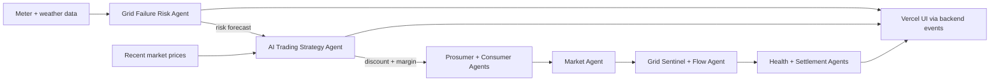

# UrjaSetu AI agents

## 1. Grid Failure Risk Agent

- Type: supervised machine learning (logistic regression).
- Purpose: predicts whether each transformer will overload in the next three hours.
- Input: household load, solar generation, transformer rating, temperature, hour, and load trend.
- Training data: 14 days of the existing Whitefield simulated meter feed by default.
- Output: transformer ID, risk score, predicted peak loading, and likely-breach flag.
- Connection: runs before each market block and sends its output to the trading AI and UI event bus.

## 2. AI Trading Strategy Agent

- Type: generative AI (Groq-hosted Qwen LLM).
- Purpose: adjusts the daily P2P selling discount and buyer margin using market conditions and grid risk.
- Input: temperature, recent clearing prices, previous strategy, and Grid Failure Risk Agent output.
- Primary model: `qwen/qwen3.8-27b`.
- Fallback model: `qwen/qwen3.6-27b` on timeout, API error, or invalid output.
- Output: safe, clamped `discount` and `margin` values shared with all trading agents.
- Safety: if both models fail, the previous strategy is kept and trading continues.

## Network



## Run

In the Render service, set `GROQ_API_KEY` as a secret environment variable.
Then run:

```powershell
python demo.py --days 1 --ai
```

Without `--ai`, the deterministic market strategy is used. The ML risk agent
still runs. Neither the API key nor Groq is required by the test suite.

Run focused tests with:

```powershell
python tests/test_ai_agents.py
```

For an optional real API smoke test:

```powershell
$env:RUN_GROQ_LIVE_TEST="1"
python tests/test_ai_agents.py
```
